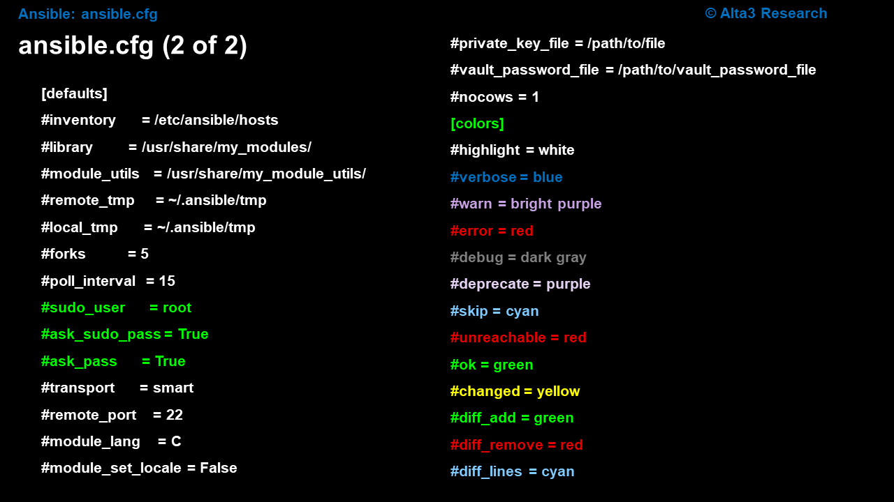

# 13. ansible.cfg setup

Lab Objective
The objective of this lab is to introduce the ability of a user to configure Ansible with a config file to reduce the dependency on cli arguments. The Ansible configuration file primarily effects the Ansible Controller, therefore, it is applicable regardless of the platform being connected to; Linux, Windows, Storage, Cloud, etc.




Before ansible runs, it will read the ansible.cfg file. In this file, we can place global configuration settings, that allow us to "type less" when executing an Ansible playbook. This file also can help us leverage how Ansible runs.

The file ansible.cfg will be searched for in the following order. If a file is found, Ansible will ignore any remaining sources:

The environmental variable ANSIBLE_CONFIG (environment variable if set)
The file ansible.cfg (in the current directory)
~/.ansible.cfg (in the home directory)
/etc/ansible/ansible.cfg (last location checked)
In this lab, we will perform the following tasks:

Write a simple Ansible Playbook to run the command date.
Remove the ansible.cfg file to demonstrate commands/behavior without.
Create a new ansible.cfg file to configure a default inventory.
Perform the ansible-config dump command to view the current ansible configuration.

### Resources:

[Git Hub Ansible Community](https://github.com/ansible)

[Configuring Ansible](https://docs.ansible.com/projects/ansible/latest/installation_guide/intro_configuration.html)

Procedure
Start out in the home directory

student@bchd:~$ cd

You might already have a copy of ~/.ansible.cfg in place. Either way, trash it. The addition of 2>/dev/null to the end of the rm command supresses an error if the file does not exist (it's a Linux thing).

student@bchd:~$ rm ~/.ansible.cfg 2>/dev/null

If you do not have an ~/.ansible.cfg file, then running a playbook without the inventory flag, will cause a failure.. The inventory flag is the -i flag. Note: Flags passed at the CLI always win precedence. Rather than utilize the -i flag, let's write that information into a file called, ansible.cfg. This file contains default values that control how Ansible runs. It can live in a number of locations. Local to the playbook, within your home directory, or in, /etc/ansible/. Let's put ours in the home directory. The only caveat is that we need to make it a hidden file (put a dot before the name of the file).

student@bchd:~$ vim ~/.ansible.cfg

Ensure your file has the following values:

[defaults]
# default location of inventory
# this can be a file or a directory
inventory = /home/student/mycode/inv/dev/

# prevents playbook from hanging on new connections
host_key_checking = False
Save and exit with Esc and then :wq

Now when you run your playbook, you no longer need to include the -i flag.

To see defaults Ansible currently has set, run the following. It will dump all of Ansible's current configuration settings.

student@bchd:~$ ansible-config dump

Scroll up and down with the arrow keys. Press q to exit ansible-config.

If you want to generate a "complete" ansible.cfg file to examine, you can do so with the following command.

student@bchd:~$ ansible-config init --disabled -t all > ansible-example.cfg

Check out all the settings available to Ansible. Note: Press q to quit.

student@bchd:~$ less ansible-example.cfg

That's it for this lab. If you tracking your work on an SCM, perform the following operations.

cd ~/mycode
git status
git add /home/student/mycode/*
git commit -m "Ansible config file"
git push origin
cd ~/
Extra Fun with ansible.cfg -- Optional
Create a new playbook, ~/mycode/playbookcmd.yml

student@bchd:~$ vim ~/mycode/playbookcmd.yml

Create the following simple playbook.

---
- name: A simple play to test ansible.cfg
  hosts: localhost
  connection: local
  gather_facts: yes

  tasks:

  # the command module issues a command on the remote host
  - name: Issue a date cmd on each remote host
    command: date
Save and exit with Esc and then :wq

The above playbook is unimpressive, but that is alright. We just want something to test some additional ansible.cfg settings. Let's try to turn on cowsay. The application cowsay surrounds standard out with fun ASCII art. It is likely you have seen cowsay, and not known what it was. So, let's see Ansible use it. Start by installing cowsay with the apt utility.

student@bchd:~$ sudo apt install cowsay -y

Turn on cowsay by adding the following line to your ~/.ansible.cfg file.

student@bchd:~$ vim ~/.ansible.cfg

To turn on cowsay set nocows=0 within ~/.ansible.cfg (under the heading [defaults]). See the last line

[defaults]
# default location of inventory
# this can be a file or a directory
inventory = /home/student/mycode/inv/dev/

# prevents playbook from hanging on new connections
host_key_checking = False

# TURN ON COWSAY
nocows = 0
Save and exit with Esc and then :wq

For Ansible, the default is to use cowsay if it is installed, so try running a playbook.

student@bchd:~$ ansible-playbook ~/mycode/playbookcmd.yml

Edit the configuration file again

student@bchd:~$ vim ~/.ansible.cfg

To turn on cowsay and other random ascii art set nocows = 0 and cow_selection = random as shown below (under the heading [defaults]).

```bash
[defaults]
# default location of inventory
# this can be a file or a directory
inventory = /home/student/mycode/inv/dev/

# prevents playbook from hanging on new connections
host_key_checking = False

# TURN ON COWSAY
nocows = 0    

# TURN ON COWS AND OTHER RANDOM ASCII ART
cow_selection = random
```

Save and exit with Esc and then :wq

Run the playbook multiple times to see some random ASCII output

student@bchd:~$ ansible-playbook ~/mycode/playbookcmd.yml

When you are tired of seen random ASCII art, you may turn nocows = 1, but the best solution is to uninstall cowsay.

student@bchd:~$ sudo apt remove cowsay -y