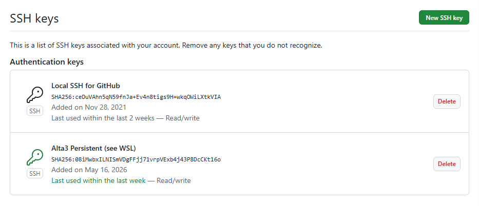

# Setting up the Alta 3 Environment 


## Repo

### Remote link 

origin  git@github.com:programmingkitchen/alta3.git (fetch)
origin  git@github.com:programmingkitchen/alta3.git (push)


#### Other Repos

- Static copies put in the alta3 repo on 6/26/2026

```bash
randall@HPLaptop:~/github/devops-the-alta3-way$ git remote -v
origin  https://github.com/alta3/devops-the-alta3-way.git (fetch)
origin  https://github.com/alta3/devops-the-alta3-way.git (push)

origin  https://github.com/alta3/kubernetes-the-alta3-way.git (fetch)
origin  https://github.com/alta3/kubernetes-the-alta3-way.git (push)

```

###  SSH config file 


- Filename 

```bash
~/.ssh/config
```

- The config 

```bash
Host 10.*
  StrictHostKeyChecking no
  UserKnownHostsFile=/dev/null
Host github.com
  HostName github.com
  IdentitiesOnly yes
  IdentityFile ~/.ssh/id_rsa_github
  User git
```

- To generate a key (if needed)

```bash
  ssh-keygen -t rsa -b 4096 -a 100 -C "programmingkitchen@gmail.com" -f ~/.ssh/id_rsa_github
```

- The public key is already loaded 



- Edit the Alta 3 files in the new environment and paste in the private key: id_alta3
- Permissions are 600

```bash
id_alta3

student@bchd:~/.ssh$ ls -la
total 24
drwx------  2 student student 4096 Jun 26 15:51 .
drwxr-x--- 10 student student 4096 Jun 26 15:57 ..
-rw-------  1 student student  567 Jun 26 15:51 authorized_keys
-rw-r--r--  1 student root     280 Jun 26 15:51 config
-r--------  1 student root    2602 Jun 26 15:51 id_rsa
-r--------  1 student root     567 Jun 26 15:51 id_rsa.pub
student@bchd:~/.ssh$ 

```

- Final config file 

```bash
student@bchd:~/.ssh$ cat config
Host 10.*
        StrictHostKeyChecking no
        UserKnownHostsFile=/dev/null
Host github.com
  HostName github.com
  IdentitiesOnly yes
  IdentityFile ~/.ssh/id_alta3
  user git

Host gitlab.com
  HostName gitlab.com
  IdentitiesOnly yes
  IdentityFile ~/.ssh/id_rsa_gitlab
  user git
  ```

### Set up git config

student@bchd:~/alta3$ git config --global user.email "rgranier@gmail.com"
student@bchd:~/alta3$ git config --global user.name "Randall Alta3"